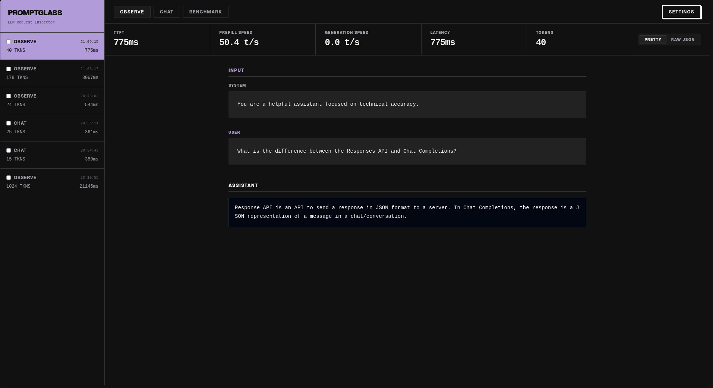
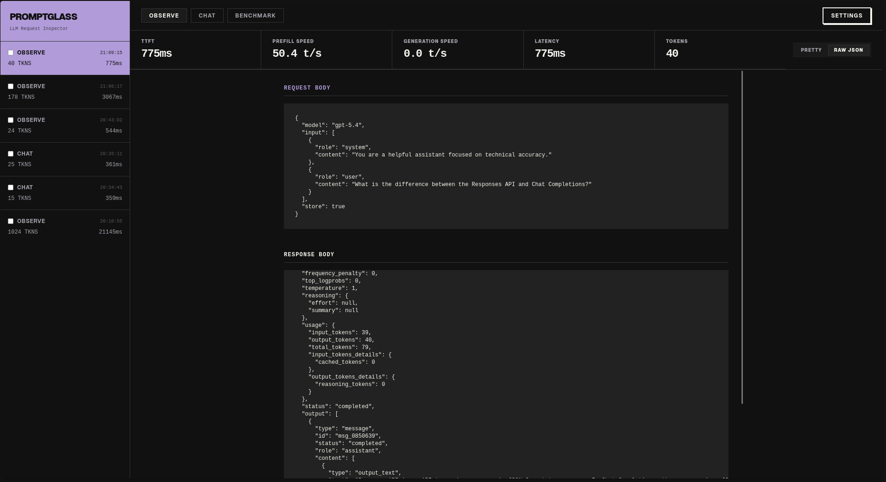
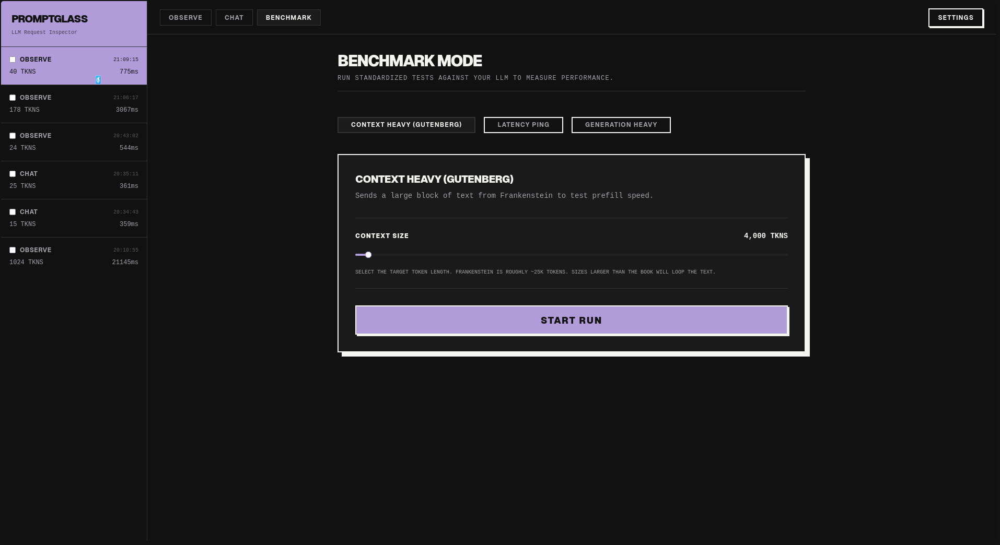
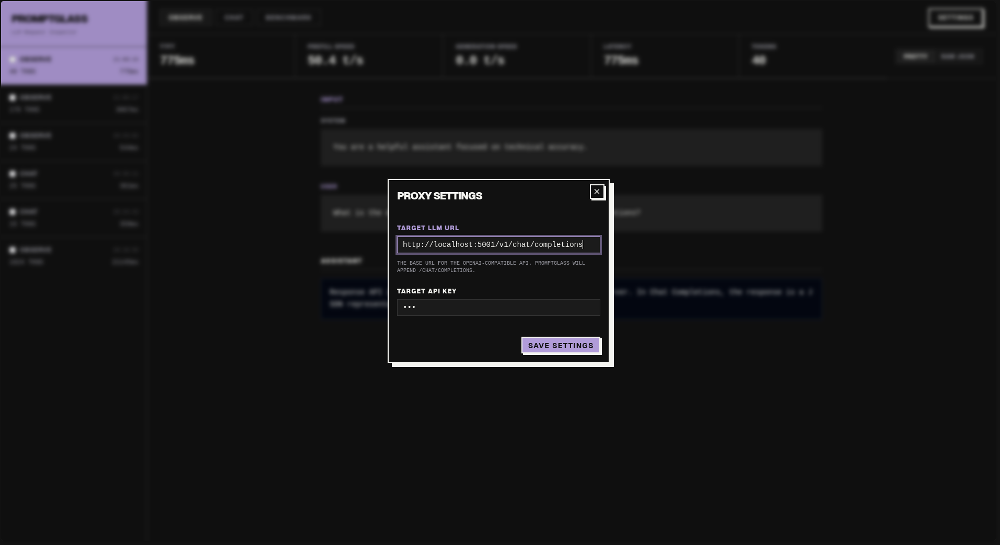

# Promptglass

An LLM Observability tool - see what your program sends to the LLM, when they do it, and how long each request takes.

Promptglass acts as an OpenAI-compatible proxy that sits between your program and the upstream LLM provider.
Simply point the LLM provider URL in your program to `http://localhost:3001/` and Promptglass will transparently proxy
and record the requests/responses.

## Features
- View the LLM requests and responses, both formatted and in raw JSON format.
- View the metrics for each request (time to first token, total latency, prompt processing and token generation speed)
- Compare the text and metrics across different calls, to detect prompt changes that might affect caching
- Benchmark the LLM inference with input-heavy and output-heavy benchmark.

## Installation
This project requires Node.js v22.5 or newer
### With npx
```bash
npx @ngvuhuy/promptglass
```
This will start both the proxy and the frontend on `localhost:3001`

### With Docker
If you don't have Node installed, you can run Promptglass directly using Docker:
```bash
docker run -it --rm \
  -p 3001:3001 \
  -v promptglass-data:/root/.promptglass \
  node:24-slim \
  npx -y @ngvuhuy/promptglass
```

### Local development
```bash
git clone https://github.com/ngvuhuy/promptglass.git
cd promptglass
npm install
npm run dev
```
This will start a frontend listening on `localhost:5173` and the proxy on `localhost:3001`.

Then, point the OpenAI URL of your project to `localhost:3001`. Go to the frontend, click on Settings, and put the original upstream LLM provider API there
(e.g. `https://api.openai.com/v1/`). Optionally, you can set the API key (if blank, the proxy will keep forwarding the API key already inside your request).
## Screenshots








## Example use cases
- Your program makes multiple LLM calls, but some seem to respond slower than others, stalling your program. 
You use Promptglass to diagnose, and found out that those calls run sequentially instead of in parallel like others.
- Using Promptglass, you found out that your program slightly changes an early part of the prompt in subsequent calls,
invalidating the prompt caching and make later LLM calls cost more.
- Using Promptglass, you found out that subsequent calls put irrelevant information in context, causing the result quality to suffer.
- You deploy a local LLM model, and use Promptglass's benchmark mode to measure the metrics to optimize the performance of the model.

